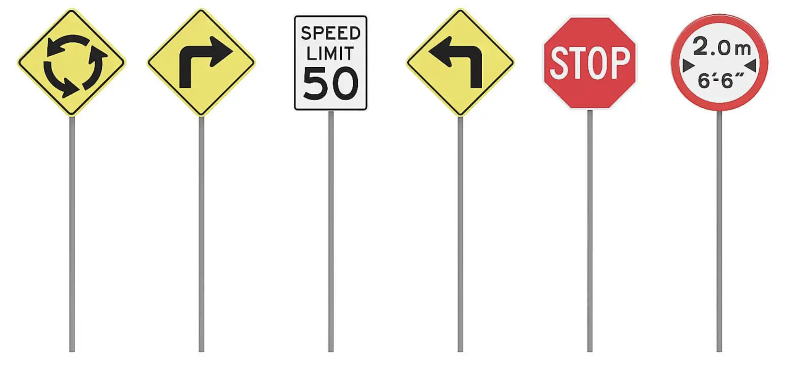

# ДЗ 8: Генерация датасета дорожных знаков в Blender

> *Задание: https://docs.google.com/document/d/1IqJIfGV2ATShYt6ECl9yAJ3wixp7Oj_8pngGly00E98/edit*

1. **Моделирование дорожного знака в Blender (20 баллов)**
    1. ☑ Cкачать и установить Blender. 
    2. ☑ Выбрать ваш любимый дорожный знак. 
    3. ☑ Смоделировать ваш любимый дорожный знак в Blender:
        * ☑ Создать примитив, повторяющий форму знака.
        * ☑ Создать палочку, на которой знак будет крепиться.
        * ☑ Нарисовать/украсть текстуру для вашего знака.
        * ☑ Выровнять UV-координаты, чтобы текстура ровно на него ложилась.
        * Дополнительно:
            * ☑ Аугментировать данные с помощью 3D-моделей, взятых со [sketchfab](https://sketchfab.com/feed).
            * ☑ Аугментировать данные с помощью добавления фона.

2. **Моделирование разметки для дорожного знака в Blender (25 баллов)**
    1. ☑ Порадовать себя чаем. Вы справились с предыдущим заданием.
    2. ☑ Теперь, чтобы это был полноценный датасет, вам нужно сгенерировать для него ограничивающие прямоугольники. Хорошей стартовой точкой может послужить [вот это обсуждение](https://blender.stackexchange.com/questions/280844/how-to-get-the-2d-bounding-box-of-a-3d-object-using-the-python-bpy-module).
    3. ☑ Сохраните разметку в любом удобном формате в файл. Например, pandas таблицей.

> Link to images dataset: 
> Saved to `annotations.csv`

3. **Обучение сети на сгенерированном датасете (5 баллов)**
    1. Теперь, когда у вас есть крутой датасет дорожных знаков — грех добру пропадать. Возьмите любой фреймворк для обучения [детекции](https://github.com/open-mmlab/mmdetection) (или что там сегодня у молодёжи популярно) и обучите сетку.
    2. Проверьте на паре реальных фоток, что обученная сетка работает.
    3. Выложить код на Github, прикрепить ссылку на датасет (захостить его на гуглодиск).
